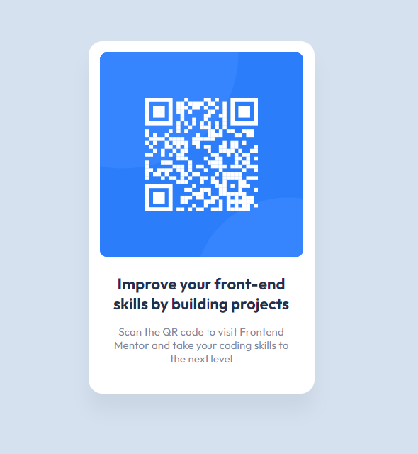

# Frontend Mentor - QR code component solution <!-- omit in toc -->

This is a solution to the [QR code component challenge on Frontend Mentor](https://www.frontendmentor.io/challenges/qr-code-component-iux_sIO_H). 

## Table of contents
- [Table of contents](#table-of-contents)
- [Overview](#overview)
  - [Screenshot](#screenshot)
  - [Links](#links)
  - [Built with](#built-with)
- [What I learned](#what-i-learned)

**Note: Delete this note and update the table of contents based on what sections you keep.**

## Overview

### Screenshot

### Links

- Solution URL: [Solution](https://www.frontendmentor.io/solutions/qr-code-component-html-css-M6oL6oPWZO)
- Live Site URL: [Live Site](https://tk-qr-code-component.netlify.app/)

### Built with

- HTML5 markup
- CSS custom properties
- Flexbox

## What I learned
- Do not put styling on <html> tag unless it's necessary.
- "alt" should be used to give the functional and contextualized label or description (rather than a visual description) and ending alt-text with punctuation is beneficial for screen reader since it will give a pause after the end of attribute sentence.
  

